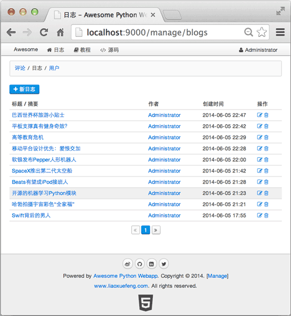

MVVM模式不但可用于Form表单，在复杂的管理页面中也能大显身手。例如，分页显示Blog的功能，我们先把后端代码写出来：

在`apis.py`中定义一个`Page`类用于存储分页信息：

```python
class Page(object):
    def __init__(self, item_count, page_index=1, page_size=10):
        self.item_count = item_count
        self.page_size = page_size
        self.page_count = item_count // page_size + (1 if item_count % page_size > 0 else 0)
        if (item_count == 0) or (page_index < 1) or (page_index > self.page_count):
            self.offset = 0
            self.limit = 0
            self.page_index = 1
        else:
            self.page_index = page_index
            self.offset = self.page_size * (page_index - 1)
            self.limit = self.page_size
        self.has_next = self.page_index < self.page_count
        self.has_previous = self.page_index > 1
```

在`urls.py`中实现API：

```python
def _get_blogs_by_page():
    total = Blog.count_all()
    page = Page(total, _get_page_index())
    blogs = Blog.find_by('order by created_at desc limit ?,?', page.offset, page.limit)
    return blogs, page

@api
@get('/api/blogs')
def api_get_blogs():
    blogs, page = _get_blogs_by_page()
    return dict(blogs=blogs, page=page)
```

返回模板页面：

```python
@view('manage_blog_list.html')
@get('/manage/blogs')
def manage_blogs():
    return dict(page_index=_get_page_index(), user=ctx.request.user)
```

模板页面首先通过API：`GET /api/blogs?page=?`拿到Model：

```json
{
    "page": {
        "has_next": true,
        "page_index": 1,
        "page_count": 2,
        "has_previous": false,
        "item_count": 12
    },
    "blogs": [...]
}
```

然后，通过Vue初始化MVVM：

```html
<script>
function initVM(data) {
    $('#div-blogs').show();
    var vm = new Vue({
        el: '#div-blogs',
        data: {
            blogs: data.blogs,
            page: data.page
        },
        methods: {
            previous: function () {
                gotoPage(this.page.page_index - 1);
            },
            next: function () {
                gotoPage(this.page.page_index + 1);
            },
            edit_blog: function (blog) {
                location.assign('/manage/blogs/edit/' + blog.id);
            }
        }
    });
}

$(function() {
    getApi('/api/blogs?page={{ page_index }}', function (err, results) {
        if (err) {
            return showError(err);
        }
        $('#div-loading').hide();
        initVM(results);
    });
});
</script>
```

View的容器是`#div-blogs`，包含一个table，我们用`v-repeat`可以把Model的数组`blogs`直接变成多行的`<tr>`：

```html
<div id="div-blogs" class="uk-width-1-1" style="display:none">
    <table class="uk-table uk-table-hover">
        <thead>
            <tr>
                <th class="uk-width-5-10">标题 / 摘要</th>
                <th class="uk-width-2-10">作者</th>
                <th class="uk-width-2-10">创建时间</th>
                <th class="uk-width-1-10">操作</th>
            </tr>
        </thead>
        <tbody>
            <tr v-repeat="blog: blogs" >
                <td>
                    <a target="_blank" v-attr="href: '/blog/'+blog.id" v-text="blog.name"></a>
                </td>
                <td>
                    <a target="_blank" v-attr="href: '/user/'+blog.user_id" v-text="blog.user_name"></a>
                </td>
                <td>
                    <span v-text="blog.created_at.toDateTime()"></span>
                </td>
                <td>
                    <a href="#0" v-on="click: edit_blog(blog)"><i class="uk-icon-edit"></i>
                </td>
            </tr>
        </tbody>
    </table>
    <div class="uk-width-1-1 uk-text-center">
        <ul class="uk-pagination">
            <li v-if="! page.has_previous" class="uk-disabled"><span><i class="uk-icon-angle-double-left"></i></span></li>
            <li v-if="page.has_previous"><a v-on="click: previous()" href="#0"><i class="uk-icon-angle-double-left"></i></a></li>
            <li class="uk-active"><span v-text="page.page_index"></span></li>
            <li v-if="! page.has_next" class="uk-disabled"><span><i class="uk-icon-angle-double-right"></i></span></li>
            <li v-if="page.has_next"><a v-on="click: next()" href="#0"><i class="uk-icon-angle-double-right"></i></a></li>
        </ul>
    </div>
</div>
```

往Model的blogs数组中增加一个Blog元素，table就神奇地增加了一行；把blogs数组的某个元素删除，table就神奇地减少了一行。所有复杂的Model-View的映射逻辑全部由MVVM框架完成，我们只需要在HTML中写上`v-repeat`指令，就什么都不用管了。

可以把`v-repeat="blog: blogs"`看成循环代码，所以，可以在一个`<tr>`内部引用循环变量`blog`。`v-text`和`v-attr`指令分别用于生成文本和DOM节点属性。

完整的Blog列表页如下：

