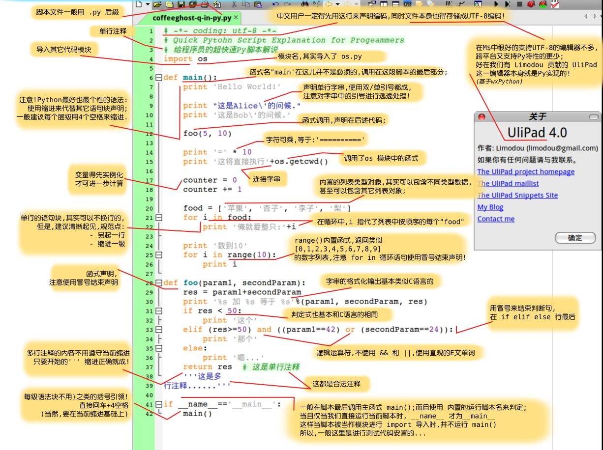

Python是一种计算机编程语言。计算机编程语言和我们日常使用的自然语言有所不同，最大的区别就是，自然语言在不同的语境下有不同的理解，而计算机要根据编程语言执行任务，就必须保证编程语言写出的程序决不能有歧义，所以，任何一种编程语言都有自己的一套语法，编译器或者解释器就是负责把符合语法的程序代码转换成CPU能够执行的机器码，然后执行。Python也不例外。

Python的语法比较简单，采用缩进方式，写出来的代码就像下面的样子：

```python
# print absolute value of an integer:
a = 100
if a >= 0:
    print a
else:
    print -a
```

以`#`开头的语句是注释，注释是给人看的，可以是任意内容，解释器会忽略掉注释。其他每一行都是一个语句，当语句以冒号“:”结尾时，缩进的语句视为代码块。

缩进有利有弊。好处是强迫你写出格式化的代码，但没有规定缩进是几个空格还是Tab。按照约定俗成的管理，应该始终坚持使用4个空格的缩进。

缩进的另一个好处是强迫你写出缩进较少的代码，你会倾向于把一段很长的代码拆分成若干函数，从而得到缩进较少的代码。

缩进的坏处就是“复制－粘贴”功能失效了，这是最坑爹的地方。当你重构代码时，粘贴过去的代码必须重新检查缩进是否正确。此外，IDE很难像格式化Java代码那样格式化Python代码。

最后，请务必注意，Python程序是大小写敏感的，如果写错了大小写，程序会报错。

## 总结

- 转义：、或者r''
- 多行字符串：'''...'''

### 动态语言

动态语言：变量本身类型不固定的语言，如：python。可以把任意数据类型赋值给变量，同一个变量
可以反复赋值，而且可以是不同类型的变量

静态语言：在定义变量时必须指定变量类型，如果赋值的时候类型不匹配，就会报错。例如
Java是静态语言

### 字符串和编码

- ASCII，1字节
- Unicode，2字节，python中用u'...'表示，Unicode转utf-8：encode('utf-8')
- utf-8，可变长编码，1-6字节，utf-8转Unicode：decode('utf-8')
- 内存中使用Unicode编码，保存在磁盘或传输使用utf-8
- ord()：字母转数字，chr()：数字转字符
- len()
- b'xxx' 字节形式表示字符串

老司机谈python语法，一张图看明白python

