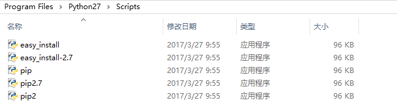
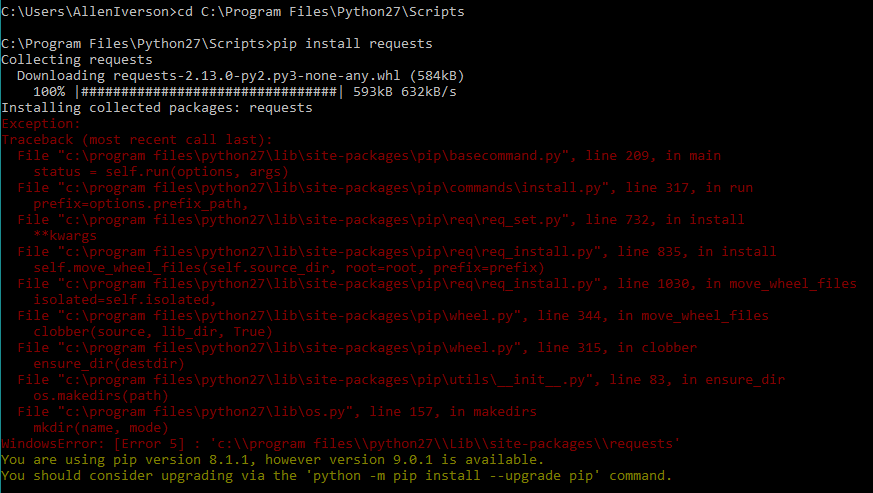
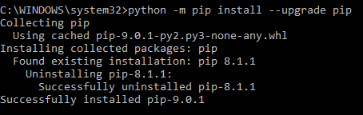
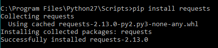
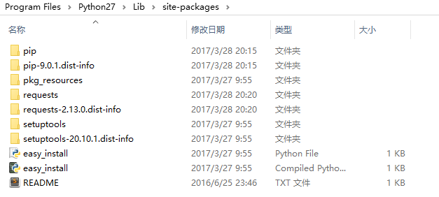
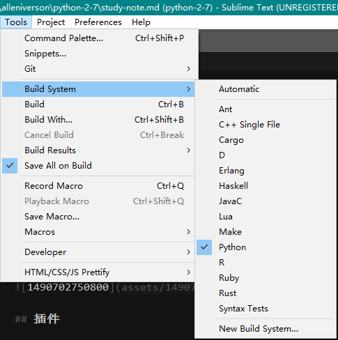

## 开发环境

pydev：http://www.pydev.org/updates

pip install





python -m pip install --upgrade pip



管理员权限打开cmd



安装的包路径





## 快捷键

tab代码补全

## 插件

- AdvancedNewFile
- Djaneiro
- Emmet
- Git
- Side Bar
- HTML/CSS/JS Prettify
- Python PEP8 Autoformat 格式化python代码
- SublimeCodeIntel
- ColorPicker
- OmniMarkupPreviewer

## 输入输出

print()

raw_input()

input()

Ctrl+C 退出程序

## 变量

global，id()

1. python中的变量不需要先定义，再使用，可以直接使用,还有重新使用用以存储不同类型的值。
2. 变量命名遵循C命名风格。
3. 大小写敏感。
4. 变量引用计数。
5. del语句可以直接释放资源，变量名删除，引用计数减1。
6. 变量内存自动管理回收,垃圾收集。
7. 指定编码在文件开头加入 # coding:UTF8或者 #coding=utf8
8. 变量本身类型不固定的语言称之为动态语言

```python
>>> a = 12 #无需定义，直接使用，python解释器根据右值决定左侧类型
>>> print a
12
>>> id(a) #变量a在内存中的编号
136776784
>>> type(a) #a的类型为int类型
<class 'int'>
>>> b = 12.34
>>> print b
12.34
>>> id(b) #变量b在内存中所占内存编号
3071447616
>>> type(b)
<class 'float'> #b的类型为float
>>> a = "itcast" #变量a从新指向一个字符串
>>> print a
itcast
>>> id(a) #变量a在内存中的编号为保存“itcast”地方，原来a所指向的内存编号里内容并没有立即释放
3071127936
>>> type(a) #变量a现在指向一个字符串
<class 'str'>
>>> c = b
>>> print c
12.34
>>> id(c) #变量c保存的内存中的编号和b一致
3071447616
>>> type(c)
<class 'float'>
>>> b = 12 #解释器在内存中发现有保存12的这个单元，于是变量b指向了此单元，减少了存储空间的反复申请与释放
>>> id(b)
136776784
>>> type(b)
<class 'int'>
>>> print b
12
>>> print a
itcast
>>> del(a)
>>> print a
Traceback (most recent call last):
File "<stdin>", line 1, in <module>
NameError: name 'a' is not defined
```


## 基础数据类型

- 整型：通常被称为是整型或整数，是正或负整数，不带小数点。
- 长整型：无限大小的整数，整数最后是一个大写(或小写)的L。
- 浮点型：浮点型由整数部分与小数部分组成，浮点型也可以使用科学计数法表示（2.5e2 = 2.5 x 102 = 250）
- 复数：复数的虚部以字母J 或 j结尾 。如：2+3j
- 布尔类型：True , False
- 字符串：单引号，双引号，三个单引号扩起来

获取变量的数据类型 type(var_name)

### 字符串

r'' 表示 '' 内部的字符串默认不转义

'''...''' 的格式表示多行内容

编码：

Unicode u'...'

“可变长编码”的 UTF-8

\# coding = utf-8

ord() , chr() , encode() , decode()

len()

格式化 %s %d

## 数据类型

整数

### 类型转换

int()

isinstance()

空值None

list

- append()
- insert()
- pop()
- pop(i)
- +组合列表
- *重复列表
- count()
- extend()
- index()
- remove()
- sort()
- reverse()

### tuple

- tuple一旦初始化就不能修改

### dict(map)

- get()
- pop(key)
- iteritems()
- itervalues()

### set

- add()
- remove()

字符串

- replace()


## 时间日期

## list列表

序列都可以进行的操作包括索引，切片，加，乘，检查成员。 序列中的每个元素都分配一个数字 它的位置，或索引，第一个索引是0，第二个索引是1，依此类推。

列表和元组二者均能保存任意类型的python对象,索引访问元素从开始 列表元素用[]包括,元素个数,值都可以改变 元组元素用()包括

通过切片 [][:] 得到子集,此操作同于字符串相关操作 切片使用的基本样式[下限:上限:步长]

### 列表脚本操作符

列表对 + 和 * 的操作符与字符串相似。+ 号用于组合列表，* 号用于重复列表。

### 列表函数&方法

Python包含以下函数:

| 函数                | 功能描述      |
| :---------------- | :-------- |
| cmp(list1, list2) | 比较两个列表的元素 |
| len(list)         | 列表元素个数    |
| max(list)         | 返回列表元素最大值 |
| min(list)         | 返回列表元素最小值 |
| list(seq)         | 将元组转换为列表  |

Python包含以下方法:

| 方法                      | 功能描述                              |
| :---------------------- | :-------------------------------- |
| list.append(obj)        | 在列表末尾添加新的对象                       |
| list.count(obj)         | 统计某个元素在列表中出现的次数                   |
| list.extend(seq)        | 在列表末尾一次性追加另一个序列中的多个值（用新列表扩展原来的列表） |
| list.index(obj)         | 从列表中找出某个值第一个匹配项的索引位置              |
| list.insert(index, obj) | 将对象插入列表                           |
| list.pop(obj=list[1])   | 移除列表中的一个元素（默认最后一个元素），并且返回该元素的值    |
| list.remove(obj)        | 移除列表中某个值的第一个匹配项                   |
| list.reverse()          | 反向列表中元素                           |
| list.sort([func])       | 对原列表进行排序                          |

## 字符串

| 方法声明         | 功能说明  |
| ------------ | ----- |
| find()       |       |
| index()      |       |
| count()      |       |
| decode()     | 解码    |
| encode       | 编码    |
| replace()    | 分割字符串 |
| split()      |       |
| capitalize() |       |
| center()     |       |
| endswith()   |       |
| startswith() |       |
| expandtabs() |       |
| isalnum()    |       |
| isalpha()    | 是否是字母 |
| isdigit()    | 是否是数字 |
| isspace()    | 是否是空格 |
| istitle()    |       |
| isupper()    | 是否是大写 |
| lower()      | 转成小写  |

## 时间和日期

### time

| 方法声明          | 功能描述                                     |
| ------------- | ---------------------------------------- |
| time()        |                                          |
| localtime()   |                                          |
| struct_time() |                                          |
| asctime()     | 接受时间元组并返回一个可读的形式为"Tue Dec 11 18:07:14 2008"（2008年12月11日周二 18时07分14秒）的24个字符的字符串 |
| clock()       | 用以浮点数计算的秒数返回当前的CPU时间。用来衡量不同程序的耗时，比time.time()更有用 |
| sleep()       |                                          |
|               |                                          |

### calendar

| 方法声明              | 功能描述 |
| ----------------- | ---- |
| month()           |      |
| firstweekday()    |      |
| isleap()          |      |
| leapdays()        |      |
| monthcalendar()   |      |
| monthrange()      |      |
| prcal()           |      |
| prmonth()         |      |
| setfirstweekday() |      |
| timegm()          |      |
| weekday()         |      |
|                   |      |

## 编码

ASCII → Unicode → UTF-8（可变长编码）

ord()

chr()

encode()

len()

格式化%：%s，%d，%?，%f，%x，%%

## 循环

for in

range()

## 函数


Built-in Functions
| [`abs()`](https://docs.python.org/2/library/functions.html#abs) | [`divmod()`](https://docs.python.org/2/library/functions.html#divmod) | [`input()`](https://docs.python.org/2/library/functions.html#input) | [`open()`](https://docs.python.org/2/library/functions.html#open) | [`staticmethod()`](https://docs.python.org/2/library/functions.html#staticmethod) |
| ---------------------------------------- | ---------------------------------------- | ---------------------------------------- | ---------------------------------------- | ---------------------------------------- |
| [`all()`](https://docs.python.org/2/library/functions.html#all) | [`enumerate()`](https://docs.python.org/2/library/functions.html#enumerate) | [`int()`](https://docs.python.org/2/library/functions.html#int) | [`ord()`](https://docs.python.org/2/library/functions.html#ord) | [`str()`](https://docs.python.org/2/library/functions.html#str) |
| [`any()`](https://docs.python.org/2/library/functions.html#any) | [`eval()`](https://docs.python.org/2/library/functions.html#eval) | [`isinstance()`](https://docs.python.org/2/library/functions.html#isinstance) | [`pow()`](https://docs.python.org/2/library/functions.html#pow) | [`sum()`](https://docs.python.org/2/library/functions.html#sum) |
| [`basestring()`](https://docs.python.org/2/library/functions.html#basestring) | [`execfile()`](https://docs.python.org/2/library/functions.html#execfile) | [`issubclass()`](https://docs.python.org/2/library/functions.html#issubclass) | [`print()`](https://docs.python.org/2/library/functions.html#print) | [`super()`](https://docs.python.org/2/library/functions.html#super) |
| [`bin()`](https://docs.python.org/2/library/functions.html#bin) | [`file()`](https://docs.python.org/2/library/functions.html#file) | [`iter()`](https://docs.python.org/2/library/functions.html#iter) | [`property()`](https://docs.python.org/2/library/functions.html#property) | [`tuple()`](https://docs.python.org/2/library/functions.html#tuple) |
| [`bool()`](https://docs.python.org/2/library/functions.html#bool) | [`filter()`](https://docs.python.org/2/library/functions.html#filter) | [`len()`](https://docs.python.org/2/library/functions.html#len) | [`range()`](https://docs.python.org/2/library/functions.html#range) | [`type()`](https://docs.python.org/2/library/functions.html#type) |
| [`bytearray()`](https://docs.python.org/2/library/functions.html#bytearray) | [`float()`](https://docs.python.org/2/library/functions.html#float) | [`list()`](https://docs.python.org/2/library/functions.html#list) | [`raw_input()`](https://docs.python.org/2/library/functions.html#raw_input) | [`unichr()`](https://docs.python.org/2/library/functions.html#unichr) |
| [`callable()`](https://docs.python.org/2/library/functions.html#callable) | [`format()`](https://docs.python.org/2/library/functions.html#format) | [`locals()`](https://docs.python.org/2/library/functions.html#locals) | [`reduce()`](https://docs.python.org/2/library/functions.html#reduce) | [`unicode()`](https://docs.python.org/2/library/functions.html#unicode) |
| [`chr()`](https://docs.python.org/2/library/functions.html#chr) | [`frozenset()`](https://docs.python.org/2/library/functions.html#func-frozenset) | [`long()`](https://docs.python.org/2/library/functions.html#long) | [`reload()`](https://docs.python.org/2/library/functions.html#reload) | [`vars()`](https://docs.python.org/2/library/functions.html#vars) |
| [`classmethod()`](https://docs.python.org/2/library/functions.html#classmethod) | [`getattr()`](https://docs.python.org/2/library/functions.html#getattr) | [`map()`](https://docs.python.org/2/library/functions.html#map) | [`repr()`](https://docs.python.org/2/library/functions.html#func-repr) | [`xrange()`](https://docs.python.org/2/library/functions.html#xrange) |
| [`cmp()`](https://docs.python.org/2/library/functions.html#cmp) | [`globals()`](https://docs.python.org/2/library/functions.html#globals) | [`max()`](https://docs.python.org/2/library/functions.html#max) | [`reversed()`](https://docs.python.org/2/library/functions.html#reversed) | [`zip()`](https://docs.python.org/2/library/functions.html#zip) |
| [`compile()`](https://docs.python.org/2/library/functions.html#compile) | [`hasattr()`](https://docs.python.org/2/library/functions.html#hasattr) | [`memoryview()`](https://docs.python.org/2/library/functions.html#func-memoryview) | [`round()`](https://docs.python.org/2/library/functions.html#round) | [`__import__()`](https://docs.python.org/2/library/functions.html#__import__) |
| [`complex()`](https://docs.python.org/2/library/functions.html#complex) | [`hash()`](https://docs.python.org/2/library/functions.html#hash) | [`min()`](https://docs.python.org/2/library/functions.html#min) | [`set()`](https://docs.python.org/2/library/functions.html#func-set) |                                          |
| [`delattr()`](https://docs.python.org/2/library/functions.html#delattr) | [`help()`](https://docs.python.org/2/library/functions.html#help) | [`next()`](https://docs.python.org/2/library/functions.html#next) | [`setattr()`](https://docs.python.org/2/library/functions.html#setattr) |                                          |
| [`dict()`](https://docs.python.org/2/library/functions.html#func-dict) | [`hex()`](https://docs.python.org/2/library/functions.html#hex) | [`object()`](https://docs.python.org/2/library/functions.html#object) | [`slice()`](https://docs.python.org/2/library/functions.html#slice) |                                          |
| [`dir()`](https://docs.python.org/2/library/functions.html#dir) | [`id()`](https://docs.python.org/2/library/functions.html#id) | [`oct()`](https://docs.python.org/2/library/functions.html#oct) | [`sorted()`](https://docs.python.org/2/library/functions.html#sorted) |                                          |

### 输入输出函数

- raw_input()

### 常用函数

- type()
- id()
- isinstance()


- abs()
- cmp()
- sum()
- id()
- type()
- max()
- min()
- list()
- range()
- del()
- enumerate()把一个list变成索引-元素对
- sort()

### 函数参数

默认参数，默认参数必须指向不变对象

定义函数def，pass

可变参*args

*list *tuple

关键字参数**

参数定义的顺序必须是：必选参数、默认参数、可变参数和关键字参数

函数作为参数

## 高级特性

### 切片

- L[m:n] m到n个
- L[:n] 前n个
- L[-n:] 后n个
- L[-2:-1]
- L[:10:2]
- L[::5]
- L[:]

### 迭代

for in , enumerate()

### 列表生成式

range()

### Generator

- next()
- generator也是可迭代对象
- 函数中包含yield

### 函数式编程

- 高阶函数：abs() map() reduce() filter() sorted()，函数作为参数，函数作为返回值，内部函数
- 闭包：返回函数不要引用任何循环变量，或者后续会发生变化的变量
- 匿名函数，lambda
- 装饰器，\__name__，@语法，@functools.wraps(func)
- 偏函数，functools.partial，__init__.py

## 模块

### 包package

每一个包目录下面都会有一个 __init__.py 的文件

### 安装第三方模块

setuptools

- easy_install
- pip

安装命令

```
pip install PIL
```

### 模块搜索路径

sys.path.append()

### 模块的文档注释

' a test module '，任何模块代码的第一个字符串都被视为模块的文档注释

### 代码作者

`__author__`

### 导包

import sys

### 特殊变量

`__xxx__`，例如：`__name__`（运行测试） , `__author__`

### 别名

import cStringIO as StringIO

### 作用域

`__xxx__`

`_xxx` private 函数或变量

`__xxx` private

### 新特性:

`__future__`

```
from __future__ import division
from __future__ import unicode_literals
```

## OOP

`__init(self,)__` 初始化或者构造方法

self

私有__(两个下划线)

`__xxx`私有变量，访问私有变量`_类名__变量名`

`_xxx` 非私有变量，但不要随意访问

`__xxx__`特殊变量

isinstance()

TypeType

 dir() 获取一个对象的所有属性和方法

set，get，has方法

### `__slots__` 

限制class的属性，仅对当前类起作用，对继承的子类是不起作用的

### @property

把一个方法变成属性调用

### 多重继承

class Student(object)

###  Mixin

额外的功能

### `__str__()`

java中的toString()

`__getattr__()`

### `__repr__()`

返回程序开发者看到的字符串，是为调试服务的

### `__iter__` 

遍历

### `__getitem__`

### `__call__`

实例调用

callable() 判断一个对象是否是“可调用”对象

### type()

获取一个类或变量的类型，或者创建一个类

### metaclass

元类，XxxMetaclass(type)，应用：ORM全称“Object Relational Mapping”

## IO

同步IO

异步IO

回调模式

轮询模式

### 文件读写

| 方法声明              | 功能描述                                   |
| ----------------- | -------------------------------------- |
| open(path , mode) | path：文件路径，mode：r读，w写，rb读二进制文件，wb写二进制文件 |
|                   |                                        |
|                   |                                        |
| close()           |                                        |
| seek()            |                                        |
|                   |                                        |
|                   |                                        |
|                   |                                        |
|                   |                                        |

文件描述符

with 语句

### file-like Object

StringIO

### 二进制文件

图片，视频

### 字符编码

codecs模块

- open()

### File对象的属性

一个文件被打开后，你有一个file对象，你可以得到有关该文件的各种信息。

以下是和file对象相关的所有属性的列表：

| 属性             | 描述                                     |
| -------------- | -------------------------------------- |
| file.closed    | 返回true如果文件已被关闭，否则返回false               |
| file.mode      | 返回被打开文件的访问模式                           |
| file.name      | 返回文件的名称                                |
| file.softspace | 如果用print输出后，必须跟一个空格符，则返回false。否则返回true |
|                |                                        |

read()

readline()

readlines()

write()

### 操作文件和目录

#### os模块

os.name

uname()

| 方法声明        | 功能描述      |
| ----------- | --------- |
| rename()    | 重命名       |
| remove()    | 删除文件      |
| os.environ  |           |
| os.getenv() | 获取系统的环境变量 |
| listdir()   |           |
| mkdir()     | 创建文件夹     |
| chdir()     | 改变当前目录    |
| getcwd()    | 显示当前目录    |
| rmdir()     | 删除目录      |

#### os.path

| 方法声明       | 功能描述         |
| ---------- | ------------ |
| abspath()  | 查看当前目录的绝对路径  |
| join()     | 合并路径         |
| split()    | 拆分路径         |
| splitext() | 拆分路径，得到文件扩展名 |
| isdir()    | 是否是目录        |
| isfile()   | 是否是文件        |

#### 环境变量

os.environ

os.getenv()

#### shutil模块

- copyfile() 复制文件

### 序列化

pickling  unpickling

#### pickle/cPickle
- dumps()
- dump()
- loads()
- load()

### JSON

json模块

- dumps()
- dump()
- loads()
- load()

## 异常

### 捕获异常

try...except...finally...

raise抛异常

### 常见异常

BaseException

ZeroDivisionError

StandardError

ValueError

AttributeError

StopIteration

TypeError

IOError

ImportError

### logging

- exception(e)
- info()
- basicConfig()
- 日志级别：debug ， info ， warning ， error

### pdb 

单步调试，断点调试

pdb.set_trace()

### 断言

assert

AssertionError

### 单元测试

unittest

- setUp()
- tearDown

### 文档测试

doctest，可以直接提取注释中的代码并执行测试。

## 进程和线程

os模块

- getpid() 获取父进程id
- fork()

### multiprocessing模块

managers

BaseManager

Process

- start()
- join()
- terminate()

Pool 进程池

- apply_async()
- close()
- join()

time

- time()
- sleep()

random

- random()

### 进程间通信

Queue

- put()
- get()
- Queue()

Pipes

### 多线程

thread模块

threading模块

- current_thread()
- name
- start()
- join()
- Lock()
- local()

主线程  MainThread 

#### Lock

- acquire()
- release()

#### GIL锁

Global Interpreter Lock

### 分布式进程

multiprocessing.managers

BaseManager

- register()
- start()
- shutdown()
- get_task_queue()
- get_result_queue()
- connect()

### ThreadLocal

一个dict，threading.local()

## 正则表达式

- \d
- \w
- *，+，？，{n}，{n,m}

### re模块

- match()
- split()
- group()
- groups()
- compile()

## 常用内建模块

logging

TCPServer，UDPServer

simplejson json

MethodType

types

slice

os

pdb

search

StringIO/cStringIO

### types

- StringType
- UnicodeType
- ListType
- TypeType

### sys

- sys.path
- sys.path.append()

### functools

@functools.wraps(func)

functools.partial()

### math

- cos()
- sin()

### collections

- namedtuple 定义一种数据类型
- Iterable
- deque 双向列表
  - append()
  - appendleft()
- defaultdict
- OrderedDict
- Counter

base64

- b64encode()
- urlsafe_b64encode()

struct模块

- pack()
- unpack()

hashlib模块

哈希算法、散列算法

- f()
- md5()
- sha1()
- update()
- hexdigest()

itertools模块

- count()
- cycle()
- chain()
- groupby()
- imap()
- ifilter()

## XML

dom

sax

- start_element
- end_element
- char_data

HTMLParser

- feed()

## 常用第三方模块

| 第三方模块                      | 功能描述          |
| -------------------------- | ------------- |
| MySQL-python               | MySQL的驱动      |
| numpy                      | 用于科学计算的NumPy库 |
| Jinja2                     | 用于生成文本的模板工具   |
| PIL：Python Imaging Library | 图片处理          |
|                            |               |
|                            |               |

re

| 方法声明      | 功能描述 |
| --------- | ---- |
| findall() |      |
| match()   |      |
|           |      |

random

| 方法声明   | 功能描述 |
| ------ | ---- |
| sample |      |
|        |      |
|        |      |

string

| 方法声明    | 功能描述 |
| ------- | ---- |
| letters |      |
| digits  |      |
|         |      |

- Counter
  - collections
- socket

beautifulsoup

Pythongoose

requests

### PIL：Python Imaging Library

Image

| 方法声明        | 功能描述        |
| ----------- | ----------- |
| open()      |             |
| save()      |             |
| thumbnail() | 缩略图         |
| format      | 格式：png，jpg等 |
| filter()    |             |
| size        | 尺寸          |
| mode        |             |
| new()       |             |
|             |             |

ImageDraw

| 方法声明    | 功能描述   |
| ------- | ------ |
| Draw()  |        |
| text()  |        |
| point() | 填充每个像素 |

ImageFont

| 方法声明       | 功能描述     |
| ---------- | -------- |
| truetype() | 创建Font对象 |
|            |          |
|            |          |

ImageFilter

| 方法声明 | 功能描述 |
| ---- | ---- |
| BLUR |      |
|      |      |
|      |      |

### requests


## 图形界面

- Tkinter
  - Frame：mainloop()
  - Widget
  - pack()
  - grid()
  - Button
  - Label
  - 输入框

## 网络编程

### TCP/IP

Socket，封装了IP和端口

- connect()
- send()
- recv()
- recvfrom()
- sendto()
- close()
- bind()
- listen()
- accept()

UDP

HTTP

## 邮件

SMTP

smtplib模块

- SMTP
- set_debuglevel()
- login()
- sendmail()
- quit()
- starttls()
- MIMEMultipart
  - attach()

email模块

- MIMEText

POP3

poplib模块

- poplib.POP3()
- getwelcome()
- user()
- pass_()
- stat()
- list()
- len()
- retr()

Parser

- parsestr()

## 数据库

NoSQL

MySQL

SQLite

sqlite3

- connect()
- cursor()
- close()
- commit()

cursor

- rowcount
- execute()
- close()
- fetchall()
- insert()
- update()
- delete()

MySQL

mysql.connector

- connect()
- cursor()
- commit()

cursor

- execute()
- rowcount
- close()
- fetchall()

SQLAlchemy

WSGI：Web Server Gateway Interface

- Flask
- Django：全能型Web框架
- web.py：一个小巧的Web框架
- Bottle：和Flask类似的Web框架
- Tornado：Facebook的开源异步Web框架


## 协程

gevent
